# Project Memento: An Organizational Memory System for Software Development

## AMP — Agent Memory Platform

### The problem

in a coding environment, we have multiple projects: each with its own stack, team, and history. We also have multiple agents working across these projects: some are project-specific (e.g., a code analysis agent that only works on one repo), while others are org-wide (e.g., a security auditor that looks at all projects). The question is: how do we design a memory system that allows these agents to learn from their work, share relevant insights across the organization, and retain useful knowledge over time — without overwhelming them with irrelevant information or creating silos?
The core tension is between **contextual relevance** and **knowledge sharing**. Some information is only useful within the context of a specific project (e.g., "the auth flow in this repo has a known edge case with token refresh"), while other information is broadly applicable across projects (e.g., "avoid using that deprecated library version"). We need a memory architecture that can capture both types of knowledge, manage their lifecycles, and make them accessible to the right agents at the right time.

**Project-scoped memory:** Configuration, stack details, local issues (e.g., "database schema quirk in this repo," "the CI runner sometimes fails on branch X").

**Org-wide memory:** Learnings, standards, and patterns shared across teams (e.g., "avoid this deprecated library," "auth flow best practice," post-mortems from incidents).

Both split further on two axes:

- **Temporal:** Expires when a condition ends (branch closes, incident resolves, sprint completes). Example: "we're in active Redis incident, expect latency."
- **Persistent:** Stays until explicitly superseded. Example: "Python 3.12 breaks this test pattern."

Additionally:

- **Agent-private:** Single agent only; session scratch work. Example: "I tried approach A, didn't work."
- **Shared:** Across agents and projects; curated or automatic. Example: "approach A failed for reason X."

### The model, fully articulated

a multi-tiered memory architecture that balances project-specific context with organizational knowledge, and temporal insights with long-term learnings

**This is the core 3×2 taxonomy:**

**This is the data flow architecture — how these six cells connect at runtime:**

#### The two axes

The problem is cleanly modeled on two orthogonal dimensions:

**Ownership axis (columns):** who can read and write

- *Agent-private* — no other agent sees this. Not even another instance of the same model.
- *Project-shared* — readable/writable by all agents operating on this project.
- *Org-wide* — readable by all agents across all projects; writeable by designated agents or after consolidation.

**Lifetime axis (rows):** when does this memory expire

- *Temporal/TTL-bound* — valid only while some external condition holds (a branch is open, an incident is active, a sprint is running). When that condition resolves, the memory should be invalidated or archived, not merely stale.
- *Persistent* — survives across all sessions and code revisions; stays valid until explicitly superseded.

This gives us exactly six cells, and each one has a different identity, access pattern, and appropriate storage mechanism.

---

#### The write-back problem

The most underrated issue in this architecture is the **consolidation pipeline** — the dashed orange arrows in the diagram. An agent learns something while working. That learning starts as *agent-private persistent* (cell 4). Later it should be promoted to *project-shared persistent* (cell 5), and if it's a cross-cutting principle, eventually to *org-wide* (cell 6). This promotion must be:

- **Asynchronous** — not in the hot path of the task
- **Curated** — not every agent scratch note belongs in org memory
- **Attributed** — you need to know which agent/session produced it and when
- **Invalidatable** — when the codebase moves on, old learnings should decay or be superseded

The key unresolved challenge in multi-agent memory research is consistency — the equivalent of cache coherence in distributed computing. Whether one agent can read another's long-term memory, whether access is read-only or read-write, and what the unit of access is (document, chunk, key-value, or trace segment) remain under-specified in all current frameworks. You will need to design this consolidation logic yourself; no off-the-shelf tool automates it fully yet.

---

#### Tool mapping to each cell

| Cell | What lives here | Best tool today |
| --- | --- | --- |
| Temporal + Agent-private | Working scratch, in-progress plan | LLM context window — no persistence needed |
| Temporal + Project-shared | Branch/PR context, sprint state | File in git notes or `.claude/state/` with TTL metadata; Zep with `valid_to` markers |
| Temporal + Org-wide | Active incidents, temp policies | Zep is the clear winner here — every edge in its knowledge graph carries explicit `valid_from`, `valid_to`, and `invalid_at` markers, enabling it to answer questions about facts that had lifespans |
| Persistent + Agent-private | Preferred patterns, personal style | Claude Code's auto-generated `MEMORY.md`; or Letta's core memory tier |
| Persistent + Project-shared | Stack config, ADRs, gotchas, known issues | `AGENTS.md` / `CLAUDE.md` for curated stable facts; Mem0 for persistent stores keyed to users, sessions, or projects, with semantic retrieval across large data sets |
| Persistent + Org-wide | Standards, dos & don'ts, post-mortems, policies | Zep's community subgraph (clusters of related entities) for complex relational knowledge; Mem0 with an `org` namespace for simpler cases |

#### On Zep vs Mem0 for the shared cells

An independent LongMemEval benchmark found Mem0 at 49.0% and Zep at 63.8% using GPT-4o. Mem0 has no native temporal model — memories are timestamped at creation but there is no concept of fact validity windows or temporal supersession. Zep models these transitions natively.

For a coding org, the temporal dimension matters a great deal (incidents resolve, migrations finish, APIs are deprecated). This strongly favors Zep or its open-source core, Graphiti, for the org-wide and project temporal cells. Mem0 wins on developer ergonomics and is a reasonable choice for the persistent project cell if you don't need temporal reasoning.

#### The one thing no current tool handles automatically

Anthropic's own multi-agent research found that hybrid setups work best — the orchestrator's memory holds high-level team memory while each specialist agent records details of its own task execution. This reduces clutter and limits cross-talk, with agents reading the orchestrator's summary instead of each other's raw traces.

This is the model to implement: an **orchestrator-level summarization pass** that periodically compresses agent-private episodic traces into project-shared consolidated learnings, and project-level learnings into org-wide principles. That summarization pipeline is yours to build — likely a scheduled agent call that reads recent private/project episodic memory, deduplicates, and promotes worthwhile entries up the hierarchy.

## Example: how this looks in practice

### Container descriptions

**Org knowledge graph — Graphiti/Zep.** The organizational brain. Stores typed entities (incidents, learnings, anti-patterns, architectural decisions) with explicit relationships and bi-temporal markers — meaning it tracks both *when something happened* and *when the org learned about it*, and can mark facts as expired when they're superseded. Graphiti is preferred over raw Zep because it runs as an embeddable Python library, supports custom entity schemas, and handles temporal supersession natively. Written only by the Consolidation Agent; read by all agents at session start.

**Project memory — Mem0.** Episodic store scoped to a project namespace. Captures what workers have discovered: edge cases, debugging patterns, performance characteristics of the specific stack, decisions made and why. Semantically queryable — the Orchestrator can ask "what do we know about the auth flow in this project?" and get ranked, relevant memories rather than a raw dump. One Mem0 namespace per project. Grows richer with every consolidated session.

**Policy & standards store — Git + AGENTS.md.** Human-authored, version-controlled ground truth: coding standards, security policies, preferred libraries, architectural patterns. Agents treat it as read-only; humans update it via normal PR review. This is the only store that requires human sign-off to change. The key design choice here is that it lives in git — it's auditable, diffable, and has the same review process as code itself.

**Orchestrator — Letta server.** The session runtime. Before any task begins, it assembles context: queries project Mem0 for relevant episodic memories, queries the Org Graph for applicable org-wide learnings, loads the applicable Policy files, and injects all of this into the worker's context window via Letta's tiered memory model (a small "core memory" block always in context + larger archival retrieval on demand). At session end it routes the session log to the Consolidation Agent.

**Worker agents — Claude + tools.** Ephemeral Claude instances, one per task. Each starts with a fully assembled context from the Orchestrator and has tool access: filesystem, code execution, git, web search. Workers do not write directly to any memory store — they write to a session log. This separation is intentional: keeping write access out of the hot path prevents polluting memory stores with every intermediate observation.

**Consolidation agent — scheduled Claude job.** The most underrated piece in the system. Runs on a schedule (nightly, or triggered at PR merge). Reads recent session logs, extracts learnings worth persisting, deduplicates against existing memories, and promotes them to the right level: project-scoped items go to Mem0, cross-cutting principles go to the Org Graph. The prompt is simple in structure: *"given these session logs, what should the organization remember?"* This is how institutional knowledge accumulates without anyone explicitly curating it.

A seventh container not shown — the **Analytics Agent** — is a Worker variant that runs periodically against the Org Graph looking for cross-project patterns, recurring incidents, and drift from standards. Its output feeds back into the Policy Store (via PR) or directly into the Org Graph.

---

### Workflow 1 — starting a new project

The goal is to begin with the full weight of org experience, not from zero.

1. Dev team creates a repo and a minimal `AGENTS.md` stub: stack, team, stated goals.
2. A "bootstrap" agent is triggered. It queries the Org Graph — *"what do we know about this stack combination? what incidents have affected similar architectures? what did other teams wish they had known at the start?"* — and synthesizes an enriched `AGENTS.md` with pre-populated recommendations.
3. A Mem0 namespace is provisioned for the project. A Letta Orchestrator instance is configured pointing at that namespace + the shared Org Graph + Policy Store.
4. First tasks run with thin project memory (nothing accumulated yet), but with full org intelligence already injected.
5. After the first few sessions, the Consolidation Agent begins building the project's episodic layer. The context gets richer with every task.

---

### Workflow 2 — ongoing project (features + fixes)

This is the steady state and should be nearly invisible to the team.

1. Dev creates a task — a PR description, issue, or prompt.
2. Orchestrator assembles context: recent project Mem0 memories ranked by relevance to the task, Org Graph learnings that match, active policies. All injected before the worker sees the task.
3. Worker agents execute. They operate with awareness of past decisions, known gotchas, and org standards — without anyone explicitly telling them. Their session log captures observations.
4. At session end or PR merge, the Consolidation Agent runs. It decides: is this learning project-specific (→ Mem0) or cross-cutting (→ Org Graph)? Does it supersede an existing entry? Is it a new class of incident?
5. The next task on this project starts with a richer context than the previous one. The project is learning.

---

### Workflow 3 — cross-project learning and proactive design

This is the strategic loop that turns individual project experience into organizational intelligence.

1. The Analytics Agent runs weekly (or triggered by an incident). It reads across the Org Graph — not just one project but all of them — looking for: recurring patterns, incident clusters, lessons independently rediscovered by multiple teams, divergence between actual practice and stated standards.
2. It produces a structured synthesis: *"three teams have hit the same Redis eviction behavior independently. Two projects share an auth pattern that has caused latency issues. The Python 3.12 upgrade created friction in four of the six projects that attempted it."*
3. This report is surfaced to tech leads for review. It is not a raw data dump — it is a curated, ranked set of recommendations with confidence scores derived from how many independent sessions contributed to each finding.
4. Approved insights flow back into the system: new entries in the Org Graph, updated `AGENTS.md` policies (via PR), or new standard library recommendations.
5. Crucially — the next new project bootstrap (Workflow 1) will automatically inherit these consolidated learnings. The flywheel closes.

The key architectural insight across all three workflows: **memory stores are append-only at the worker level and curated at the consolidation level**. Workers never decide what is worth remembering — that judgment lives in the Consolidation Agent, which has broader context and can compare across sessions. This keeps the stores clean, prevents noise accumulation, and makes the system's knowledge progressively more signal-dense rather than more cluttered.

## The Name

"Project Memento" — a nod to the film about memory and identity, but also a play on "memento mori" (remember that you will forget). The name captures the essence of the system: an organizational memory that helps us remember what we would otherwise forget, while acknowledging that not everything is worth remembering. It's a tool for collective recall, learning, and wisdom in software development.

**The film (Nolan, 2000)** — Leonard has anterograde amnesia: he cannot form new memories. Each session he wakes with no continuity. To function, he builds an elaborate external memory system: polaroids, written notes, and tattoos on his own body. He doesn't fight his condition — he architectures around it.
The parallel is exact and a little humbling: your agents are Leonard. Every session starts cold. Memento is the system that lets them act with continuity they cannot natively have.
And look at how cleanly the film's memory tiers map to your architecture:
Leonard's systemYour systemTattoos — permanent, always visible, on his bodyAGENTS.md / Policy Store — always injected, human-curatedPolaroids + written notes — medium-term, queryableMem0 project memory — episodic, semanticThe Fact — a single truth he trusts absolutelyOrg Graph (Graphiti) — typed, sourced, temporalScraps of paper — session scratchWorking context window — ephemeral

Memento in Latin is the imperative of meminisse — "remember!" It's a command. A warning. The thing you carry so you don't forget.
The one honest irony: in the film, Leonard's external memory system is ultimately manipulated — someone edits his notes and he acts on false memory. That's a genuine threat model for your system too. Worth naming a design principle after it: the Memento problem — ensuring the consolidation layer can't be poisoned by a bad session.
